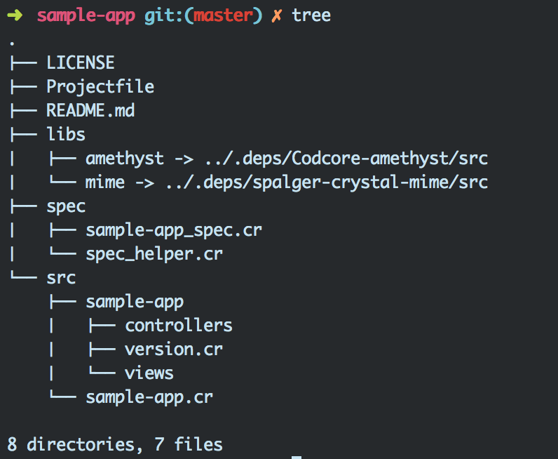

# amethyst-bin

This is an executable shell script for setting up a base [Amethyst](https://github.com/Codcore/amethyst) application
and installing dependencies automatically.

## Usage
Since this is an executable you need to copy and run it like below.

```
  curl https://raw.githubusercontent.com/Sdogruyol/amethyst-bin/master/amethyst > amethyst && chmod +x amethyst
  ./amethyst sample-app
```

Here's the file structure for the skeleton app.


